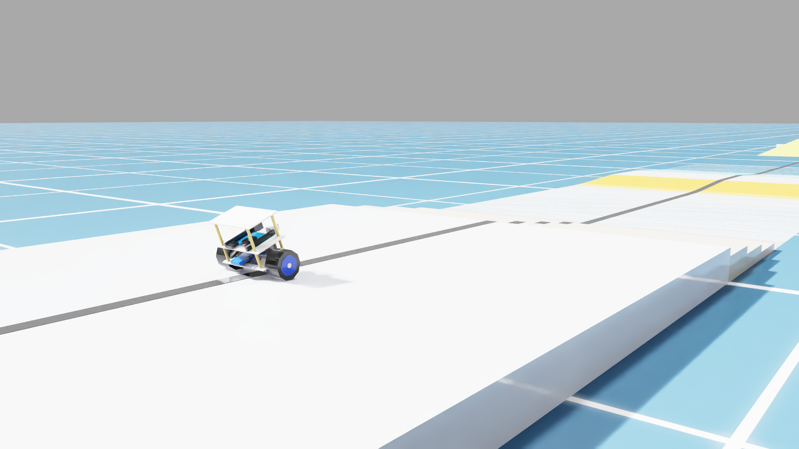

# Two-Wheel Balance Car — Isaac Sim 5.0 Teaching Project

A self-balancing two-wheel cart simulated in **NVIDIA Isaac Sim 5.0**, with classical (PID / LQR / LQI / three-ring) and learning-based (PPO) controllers. Cart dimensions, motor specs, and IMU layout are modelled after a real **STM32 + MPU6050 + GB37** balance car. The cart can traverse an obstacle course with stairs, ramps, and a working seesaw.

> 一個在 Isaac Sim 5.0 中模擬的雙輪自平衡小車，搭配 PID/LQR/PPO 多種控制器，並可在含樓梯、斜坡、蹺蹺板的障礙場景中測試。物理參數對齊真實 STM32 平衡車，可作為 sim2real 教學起點。



---

## What's inside / 內容

- **Cart asset**: USD model with realistic mass, COM, motor effort limits matched to GB37 + MPU6050 hardware.
- **Obstacle course**: stairs (10 cm total drop) → ramp_up (3°) → apex → ramp_down → flat → **working seesaw** → finish zone.
- **Controllers**: PID (three loops: balance + speed + turn), LQR (full state), LQI (LQR + velocity integrator), three-ring parallel PID, plus PPO. **See [docs/CONTROL_METHODS.md](docs/CONTROL_METHODS.md) for what each one does and when to use it.**
- **RL pipeline**: PPO via Isaac Lab 2.0 with 4096 parallel envs. The shipped task converges to **stable upright balance** in ~1500 iter / ~15 min on RTX 4070. Velocity tracking is **not** learned by the current reward shaping — see `docs/HONEST_REPORT.md` for what works and what doesn't.
- **Sim2real fidelity tools**: MPU6050 noise/bias injection, encoder quantization, motor stall-torque + back-EMF model.

---

## Quick Start / 快速開始

### 1. Install Isaac Sim 5.0

Download from [NVIDIA Developer](https://developer.nvidia.com/isaac/sim). Free for academic / individual use. **Requires an NVIDIA RTX GPU with ≥ 8 GB VRAM** (we test on RTX 4070, 12 GB).

下載後安裝到任意路徑。記住 install 完成的位置（裡面要有 `python.bat`）。

### 2. Clone this repo / 下載專案

```cmd
git clone https://github.com/<your-username>/two_wheel_balance.git
cd two_wheel_balance
```

### 3. Tell the launcher where Isaac Sim is / 告訴 launcher 你的 Isaac Sim 在哪

Open `setup_env.bat` in a text editor, change the `ISAACSIM_PATH` line to match where you installed Isaac Sim, then **double-click** `setup_env.bat`. This sets a persistent Windows environment variable — you only do this once.

打開 `setup_env.bat`，修改 `ISAACSIM_PATH` 那一行指向你 Isaac Sim 安裝路徑，然後對檔案**點兩下執行**。這會永久設定 Windows 環境變數，只需做一次。

```
set "ISAACSIM_PATH=D:\isaac\isaacsim"
                  ^^^^^^^^^^^^^^^^^^^^
                  Change this to your install path
```

### 4. Run the demo / 跑第一個 demo

Double-click `launch_pid.bat` (this is the **default PID controller** demo). Isaac Sim opens (~25 s startup), shows the cart on the obstacle course.

對 `launch_pid.bat` 點兩下，等 ~25 秒 Isaac Sim 視窗跳出來。

**Controls** (click the 3D viewport first to grab keyboard focus):

| Key | Action |
|---|---|
| W | Forward / 前進 |
| S | Backward / 後退 |
| A | Turn left / 左轉 |
| D | Turn right / 右轉 |

The cart should self-balance, drive forward across the obstacle course, and flip the yellow seesaw when it crosses the pivot.

車子應該能自我平衡、按 W 過障礙、爬到黃色蹺蹺板上後把板子翻過去。

---

## Repository layout / 專案結構

```
two_wheel_balance/
├── README.md                     ← You are here
├── LICENSE                       ← MIT
├── setup_env.bat                 ← One-time Isaac Sim path setup
├── launch_pid.bat                ← Default PID controller (3-loop: balance + speed + turn)
├── launch_lqr.bat                ← Full-state LQR
├── launch_lqi.bat                ← LQR with velocity integrator
├── launch_threering.bat          ← Three-ring parallel PID (W13 course-material spec)
├── launch_no_encoder.bat         ← PID with wheel encoders disabled (IMU-only)
├── launch_train_no_encoder.bat   ← Train PPO (no-encoder variant)
├── launch_eval_rl_encoder.bat    ← Eval pre-trained PPO with encoder
├── launch_eval_rl_no_encoder.bat ← Eval pre-trained PPO without encoder
├── docs/
│   ├── QUICKSTART.md             ← Detailed setup (this README expanded)
│   ├── CONTROL_METHODS.md        ← All control methods explained for students
│   ├── CONTROL_ARCHITECTURE.md   ← Sign conventions, control loop diagram
│   ├── HONEST_REPORT.md          ← What works and what doesn't (no marketing)
│   ├── SIM_VS_REAL.md            ← Every physics parameter and where it came from
│   ├── HARDWARE_NOTES.md         ← Real-cart dimensions & motor specs
│   └── REFERENCES.md             ← External reference implementations
├── sim/
│   ├── assets/                   ← Pre-generated USD scenes (load in Isaac Sim directly)
│   │   ├── two_wheel_balance_car/
│   │   ├── combined_course/      ← Main test scene (stairs + ramps + seesaw)
│   │   ├── balance_board/        ← Standalone seesaw test (minimal repro)
│   │   ├── seesaw_world/
│   │   ├── slope_world/
│   │   ├── stairs_world/
│   │   ├── gravel_world/
│   │   └── line_world/
│   ├── scripts/
│   │   ├── play_pid_effort.py    ← Main controller + sim loop
│   │   ├── create_*.py           ← USD scene generators (rerun to regenerate USDs)
│   │   └── ...
│   └── output/                   ← Telemetry CSVs go here (gitignored)
├── rl/                           ← Standalone Stable-Baselines3 PPO experiments
├── isaaclab_task/                ← Isaac Lab 4096-env PPO training task
├── scripts/                      ← Isaac Lab task entry points
└── hardware/                     ← Real-cart hardware notes
```

---

## What works, what doesn't / 哪些 work、哪些不 work

**Honest status** (no marketing — see `docs/HONEST_REPORT.md` for full matrix):

| Scenario | PID | LQR | LQI | PPO |
|---|---|---|---|---|
| Stand still (5 min) | ✓ | ✓ | ✓ | ✓ |
| Drive forward on flat | ✓ | ✓ | ✓ | ✓ |
| Press A/D briefly | ✓ | ✓ | ✓ | ✓ |
| 3° ramp up/down | ✓ | ✓ | ✓ | ✓ |
| 25 mm stair drop | ✗ | ✗ | ✗ | ✓ |
| Seesaw flip | ✓ (drives across, sometimes rolls after) | ✗ | ✗ | ✓ |
| Full combined course | partial | ✗ | ✗ | ✓ |
| Gravel terrain | ✗ *(single-axle roll instability)* | ✗ | ✗ | ✗ |

**Don't expect classical controllers to traverse the full obstacle course** — that's a hard-mode RL benchmark, not a PID demo.

教學情境上 PID/LQR 適合用來教平衡、簡單斜坡。蹺蹺板跟樓梯要用 PPO。Gravel 地形目前沒有 controller 能過（單軸雙輪硬體本身 roll 不穩定）。

---

## Training your own PPO policy / 自己訓練 RL

The `rl/` folder has standalone Stable-Baselines3 examples (CPU/single-GPU, slow). For real training, use the Isaac Lab task:

```cmd
"%ISAACSIM_PATH%\python.bat" scripts/train_lab.py
```

Runs **4096 parallel envs**, ~15-20 min on RTX 4070. **Honest caveat**: shipped checkpoints converge to "stand still" rather than learning velocity tracking — see `docs/HONEST_REPORT.md`.

---

## Known gotchas / 已知陷阱

Key Isaac Sim 5.0 / PhysX issues we learned the hard way:

- **PhysX static-dynamic friction lock** — a static collider touching a dynamic body's surface creates a permanent contact constraint that locks joint rotation, even when the joint itself is free. Always leave ≥ 5 mm gap between decorative static geometry and dynamic bodies.
- **`rendering_dt` must equal `physics_dt`** in Isaac Sim 5.0 standalone — otherwise controllers go unstable in GUI while passing headless.
- **Single-axle two-wheel hardware cannot correct roll** — don't try to fix it in software, it's geometric. The cart will roll over on gravel/uneven surfaces regardless of controller.
- **PPO with 4096 envs in Isaac Lab** beats single-env standalone RL by an order of magnitude for this task.

---

## Acknowledgments / 參考來源

This project draws ideas from several open-source references (we do **not** redistribute them — go read them at their source):

- [WheeledLab](https://github.com/UWRobotLearning/WheeledLab) — wheel collider configuration patterns.
- [Isaac-RL-Two-wheel-Legged-Bot](https://github.com/jaykorea/Isaac-RL-Two-wheel-Legged-Bot) — Flamingo Edu v1 reward shaping, used to anchor our PPO setup.
- Yahboom STM32 平衡小車 — physical cart hardware platform we modelled.
- Course material from a Taiwan vocational embedded-systems class (W13 三環並聯 PID) — three-ring PID structure.

See `docs/REFERENCES.md` for the full list with URLs.

---

## License

MIT. See [LICENSE](LICENSE). Cite this repo if you use it in academic work.

---

## Contact / 聯絡

Issues and PRs welcome on GitHub. For sim2real questions about the physical cart, please attach the CSV from `sim/output/pid_effort_timeseries.csv` for the specific scenario, not just a screenshot — text/numbers debug 10× faster than images.
